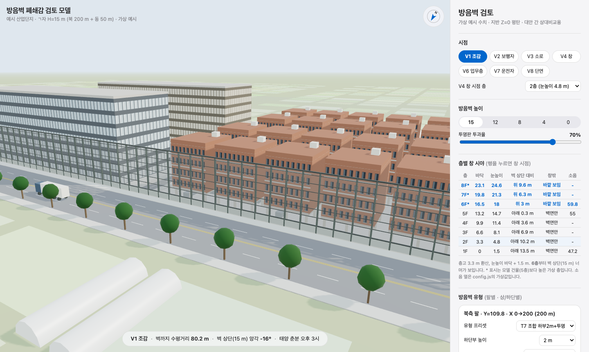

# 사례 2. 방음벽 시각영향(폐쇄감) 검토: 3차원 모델 + 생성형 이미지

높은 방음벽이 계획된 구간에서, 벽 뒤 건물과 보행자가 느낄 폐쇄감을 협의·심의 전에 미리 확인하는 도구입니다.
이 폴더의 수치는 **모두 가상 예시값**입니다. 실제 사업의 도면·환경영향평가서 발췌·생성 이미지는 넣지 않았습니다.



## 1. 무엇을 보는 도구인가

| 구분 | 3차원 모델 (이 폴더의 HTML) | 생성형 이미지 (절차 문서) |
|---|---|---|
| 보는 것 | 배치·높이·이격·그림자 등 **큰 그림과 치수** | 사람 눈높이에서 본 **실제 모습의 인상** |
| 장점 | 높이 대안·유형·계절을 바로 바꿔 비교, 앙각·거리 수치 표시 | 재질·분위기가 사실적이라 설명 자료로 전달력이 큼 |
| 약점 | 입면·재질이 단순함 | 치수가 부정확할 수 있어 척도 검증이 필수 |
| 문서 | 이 README | [docs/generative-image-guide.md](docs/generative-image-guide.md) |

두 가지를 함께 씁니다. 배치와 치수는 3차원 모델로 확인하고, 사람 눈높이의 인상은 생성형 이미지로 보여 줍니다.

## 2. AI가 한 일과 사람이 검증한 일

| AI가 한 일 | 사람이 검증한 일 |
|---|---|
| 요구사항 문서(좌표 표·시점 목록·금지 사항)를 받아 three.js 모델 코드 작성 | V8 단면의 치수선(도로 폭·벽 높이·이격·건물 높이)과 창 시점 앙각을 손으로 검산 |
| 방음벽 유형 10종·높이 대안·계절별 태양·2×2 비교 화면 구현 | 도면 축척막대로 벽 연장·도로 폭을 실측해 입력값 확정 |
| 배치도를 참조 이미지로 받아 조감·보행자·창 시점 이미지 생성 | 차량 높이를 기준자로 이미지 속 벽 높이를 역산, 방위·도로망이 배치도와 맞는지 대조 |
| 층별 눈높이와 벽 상단 비교 표 계산 | 판정 방식 결정: 국내에 폐쇄감 정량기준이 없으므로 **대안 간 상대비교**로 제시 |

## 3. 폴더 구성

```
02_barrier-3d/
├── README.md                     이 문서
├── barrier-review-offline.html   더블클릭용 단일 파일(빌드 결과, 인터넷 불필요)
├── index.html                    읽기 쉬운 소스: 화면 구조와 스타일
├── config.js                     설정: 자기 사업 수치는 여기만 고침
├── app.js                        소스: 3차원 모델 로직(설정값으로 배치 계산)
├── build_offline.py              단일 파일 빌드 스크립트(파이썬 표준 라이브러리만 사용)
├── lib/three/                    three.js r184 (MIT, LICENSE 포함)
│   ├── three.module.min.js
│   ├── three.core.min.js
│   ├── addons/controls/OrbitControls.js
│   └── LICENSE
└── docs/
    ├── generative-image-guide.md 생성형 이미지 제작 절차
    └── screenshot.png            가상 수치 화면
```

## 4. 여는 법

| 방법 | 절차 | 인터넷 |
|---|---|---|
| 바로 보기 | `barrier-review-offline.html` 더블클릭 (크롬·엣지 권장) | 불필요 |
| 소스로 보기 | 이 폴더에서 `python3 -m http.server 8000` 실행 후 `http://localhost:8000/` 접속 | 불필요 |

- `index.html`을 더블클릭하면 열리지 않습니다. 브라우저가 `file://`에서 ES 모듈 파일 불러오기를 막기 때문이며, 그래서 단일 파일판을 따로 둡니다.
- 그래픽 가속(WebGL)이 꺼진 PC에서는 화면이 비어 보일 수 있습니다.

## 5. 조작법

| 조작 | 동작 |
|---|---|
| 왼쪽 드래그 · 오른쪽 드래그 · 휠 | 회전 · 이동 · 확대 (V8 단면은 이동·확대만) |
| 시점 V1~V8 | V1 조감, V2 벽 뒤 보행자, V3 동측 소로 보행자, V4 벽 뒤 건물 창(층 선택), V6 업무 건물 최상층 창, V7 북측 도로 운전자, V8 단면(정사영) |
| 방음벽 높이 | `config.js`의 높이 대안 버튼(예: 15·12·8·4·0 m) |
| 층별 창 시야 표 | 층마다 눈높이와 벽 상단의 차이, 창밖 판정. 행을 누르면 그 층 창 시점으로 이동 |
| 방음벽 유형 | 북측·동측 팔 따로, 하단·상단 따로 지정. T1~T3 투명(조류충돌 방지 무늬), T4~T6 불투명, T7·T8 조합, T9 상단 절곡, T10 벽면 녹화 |
| 유형 비교 | 같은 시점에서 T1·T4·T7·T9를 2×2로 나란히 표시 |
| 환경 | 동지·춘분·하지 정오, 춘분 오후 3시 태양(그림자 반영), 10 m 격자, 건물 표시 |
| 화면 아래 막대 | 현재 시점에서 벽까지 수평거리와 벽 상단 앙각 |
| 가정값·근거 보기 | 설정값으로 만든 가정 목록과 근거 문서 목록 |

## 6. 자기 사업 수치로 바꾸는 법

1. `config.js`를 메모장 등으로 열어 숫자를 고칩니다. (단일 파일판만 쓸 때는 `barrier-review-offline.html` 위쪽의 ｢설정(CONFIG)｣ 블록을 고쳐도 됩니다.)
2. 소스판은 새로고침하면 반영됩니다. 단일 파일판을 다시 만들려면 `python3 build_offline.py`를 실행합니다.
3. V8 단면의 치수선과 V4 창 시점 앙각을 먼저 검산합니다. 숫자가 맞으면 나머지 시점도 믿을 수 있습니다.

좌표계는 원점 = 검토 구역 남서 모서리, X = 동쪽, Y = 북쪽, 단위 m입니다. 방음벽은 ㄱ자(북측 팔 + 동측 팔)로 가정합니다.

| 항목 | 의미 | 예시값(가상) |
|---|---|---|
| `projectName` | 화면 제목의 사업명 | 예시 산업단지 |
| `latitudeDeg` | 위도(태양 고도 계산) | 36.5 |
| `wall.heights` | 비교할 높이 대안, 0은 미설치 | [15, 12, 8, 4, 0] |
| `wall.defaultHeight` | 처음 열 때 높이 | 15 |
| `wall.northArmLength` | 북측 팔 연장 | 200 |
| `wall.eastArmLength` | 동측 팔 연장(구역 깊이를 넘으면 자동으로 줄임) | 50 |
| `wall.postSpacing` | 지주 간격 | 4 |
| `wall.transmittance` | 투명판 투과율 기본값(%) | 70 |
| `wall.defaultPreset` | 기본 유형(T1~T10) | T7 |
| `roads.north` | 벽이 면하는 도로 폭·차로 수 | 25 m · 4차로 |
| `roads.east` | 동측 팔이 면하는 도로 폭·차로 수 | 20 m · 3차로 |
| `roads.local` | 구역 안 소로 폭·차로 수 | 10 m · 2차로 |
| `roads.sidewalk` | 편측 보도 폭 | 3 |
| `site.depth` | 남측 경계에서 벽까지 거리 | 110 |
| `site.villaZoneWidth` | 벽 뒤 근린생활 용지 폭 | 96 |
| `site.setback` | 벽(필지 경계)에서 건물 외벽까지 이격 | 3 |
| `villa.floors` | 벽 뒤 건물 층수(필로티 포함) | 5 |
| `villa.floorHeight` | 층고(층별 시야 환산에도 사용) | 3.3 |
| `villa.piloti` | 1층 필로티 여부 | true |
| `villa.footprintW` · `footprintD` · `gap` | 건물 폭·깊이·동 사이 간격 | 12 · 14 · 3 |
| `office.floors` · `floorHeight` | 업무 건물 층수·층고 | 7 · 4.0 |
| `research.floors` · `floorHeight` · `blockWidth` | 동측 도로 건너편 건물 | 5 · 4.0 · 70 |
| `floorAnalysis.eyeHeight` | 바닥에서 눈높이 | 1.5 |
| `floorAnalysis.maxFloor` | 표에 보일 최고 층 | 8 |
| `floorAnalysis.noiseByFloor` | 선택: 층별 예측 소음 dB(A), 없으면 `{}` | 1층 47.2 · 5층 55.0 · 6층 59.8 |
| `sources` | ｢근거｣ 목록에 보일 문서명 | 자리표시 문구 |

벽 모양이 ㄱ자가 아니거나 용지 구성이 크게 다르면 `app.js`의 ｢1. 배치 계산｣과 ｢6. 건물｣ 부분을 고칩니다. AI 코딩 도구에 이 README와 자기 사업의 좌표 표를 함께 주고 수정을 맡기면 됩니다.

## 7. 층고 환산으로 창 시야를 판단하는 원리

창밖이 벽면만 보이는지, 벽 너머가 보이는지는 **눈높이와 벽 상단 높이의 비교**로 판단합니다. 벽이 건물 바로 앞(이격 수 m)에 있으면 창에서 올려다본 앙각이 70도를 넘어, 눈높이가 벽 상단보다 낮은 층은 사실상 벽면만 보입니다.

- n층 눈높이 = (n − 1) × 층고 + 눈높이(1.5 m)
- 처음 벽 너머가 보이는 층 = ⌊(벽 높이 − 1.5) ÷ 층고⌋ + 2

가상 예시(벽 15 m, 층고 3.3 m):

| 층 | 바닥 (m) | 눈높이 (m) | 벽 상단(15 m) 대비 | 창밖 |
|---|---|---|---|---|
| 1 | 0.0 | 1.5 | 13.5 m 아래 | 벽면만 |
| 3 | 6.6 | 8.1 | 6.9 m 아래 | 벽면만 |
| 5 | 13.2 | 14.7 | 0.3 m 아래 | 벽면만 |
| 6 | 16.5 | 18.0 | 3.0 m 위 | 바깥 보임 |

⌊(15 − 1.5) ÷ 3.3⌋ + 2 = 4 + 2 = 6, 즉 1~5층은 창밖이 벽면이고 6층부터 벽 너머가 보입니다. 벽 높이를 8 m로 낮추면 ⌊6.5 ÷ 3.3⌋ + 2 = 3층부터 트입니다.

같은 표에 층별 예측 소음을 나란히 놓으면 해석이 쉬워집니다. 소음은 벽 상단을 넘어 도달하므로, 대개 **시야가 트이는 층에서 소음 저감효과도 줄어듭니다**. 시야와 소음이 같은 층에서 갈리는지 확인해 대안 설명에 씁니다.

앙각 참고(눈높이 1.5 m, 벽까지 10 m): 벽 15 m는 약 53.5도, 벽 4 m는 약 14.0도입니다.

## 8. 생성형 이미지

사람 눈높이 조감·보행자 시점(높이 대안별)·고층 창 시점 이미지는 이미지 생성 AI(Gemini 계열)에 **참조 배치도**를 함께 넣어 만들고, **차량·사람 높이로 척도를 검증**합니다.
절차와 프롬프트 틀, 검증 방법, 실패 사례는 [docs/generative-image-guide.md](docs/generative-image-guide.md)에 있습니다.

## 9. 유의사항

- **폐쇄감의 국내 법정 정량기준은 없습니다.** ｢방음시설의 성능 및 설치기준｣(환경부 고시) 제13조는 조망·일조·채광이 필요할 때 투명방음판을 쓰도록 하는 정성 규정뿐입니다. 결과는 **대안 간 상대비교**(높이·유형·이격)로 제시합니다.
- 모델은 치수 검토용 단순화 모델입니다. 건물 입면·색상·주변 농촌 맥락은 임의이며, 지반은 평탄(Z=0)으로 가정합니다. 도로 종단·부지 계획고가 다르면 결과가 달라집니다.
- 벽 위치를 도면에서 판독해 입력한 경우 개략치임을 밝힙니다. 기점·종점 좌표가 확보되면 그 값으로 바꿉니다.
- 투명판 조류충돌 방지 무늬(5×10 규칙)는 가이드라인 기준으로, 법령 별표 원문은 직접 확인이 필요합니다.
- 생성 이미지는 실제 설계를 옮긴 것이 아니라 계획 제원에 맞춘 **예시 장면**입니다. 자료에 인용할 때 이 점과 척도 검증 결과를 함께 적습니다.
- 실제 사업 도면을 외부 AI 서비스에 올리기 전에 기관 보안 지침을 확인합니다.

## 10. 서드파티 라이브러리

| 이름 | 버전 | 파일 | 라이선스 | 출처 |
|---|---|---|---|---|
| three.js | r184 (npm `three@0.184.0`) | `build/three.module.min.js`, `build/three.core.min.js`, `examples/jsm/controls/OrbitControls.js` | MIT (`lib/three/LICENSE`) | https://threejs.org · https://github.com/mrdoob/three.js |

`barrier-review-offline.html`에도 같은 라이브러리가 그대로 들어 있으며, 라이선스 헤더를 유지합니다.
